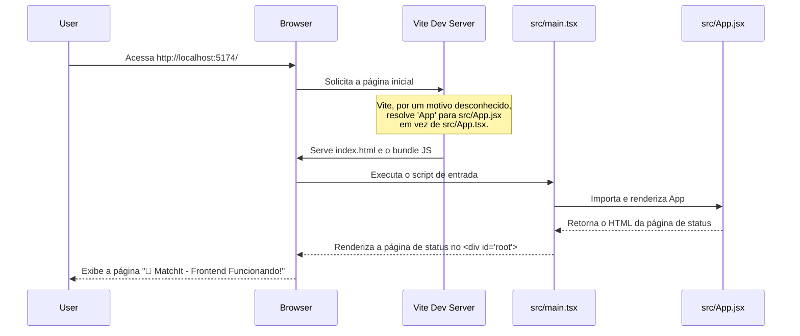
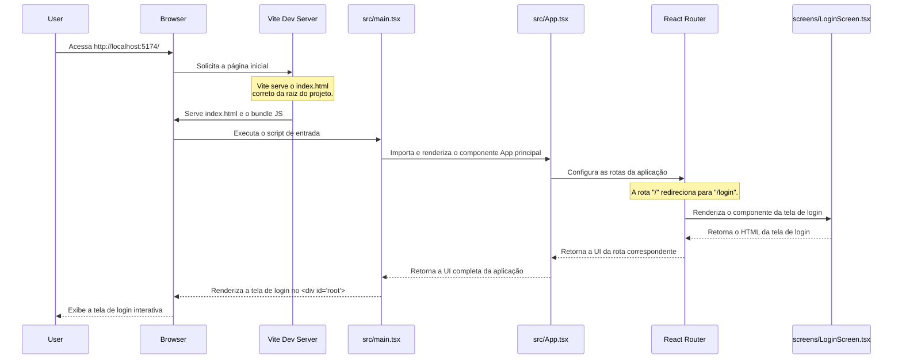

# Análise do Erro de Carregamento do Frontend

## 1. Resumo do Problema

O sintoma principal é que, ao iniciar a aplicação, em vez da tela de login esperada, é exibida uma página de status estática com o título "🎯 MatchIt - Frontend Funcionando!".

Isso indica que o servidor de desenvolvimento (Vite) está servindo um componente React incorreto (`src/App.jsx`) como o ponto de entrada da aplicação, em vez do componente principal que contém o roteamento (`src/App.tsx`). Apesar de várias tentativas de correção (ajuste de `vite.config.ts`, `tsconfig.json`, `index.html` e o ponto de entrada `src/main.tsx`), o comportamento persiste, sugerindo um problema de cache profundo ou uma configuração conflitante não óbvia.

---

## 2. Diagrama de Sequência: O Que Está Acontecendo (Fluxo Incorreto)

Este diagrama ilustra o fluxo que está ocorrendo atualmente, resultando na exibição da página de status.

---

## 3. Diagrama de Sequência: Como Deveria Funcionar (Fluxo Correto)

Este diagrama ilustra o fluxo esperado para uma aplicação React/Vite funcional.

---

## 4. Causa Raiz Provável e Próximos Passos

A causa mais provável é um **problema de cache persistente no Vite ou uma configuração conflitante** que não está visível nos arquivos de configuração padrão (`vite.config.ts`, `tsconfig.json`, `package.json`). O Vite pode ter um cache interno que não foi limpo mesmo com o comando `--force`.

**Plano de Ação Recomendado:**

1.  **Limpeza Manual do Cache:** Excluir a pasta `node_modules/.vite` para forçar uma recriação completa do cache.
2.  **Simplificação Extrema:** Renomear `src/App.jsx` para `src/StatusPage.jsx` para eliminar qualquer ambiguidade na resolução do nome `App`.
3.  **Verificação do Ponto de Entrada:** Garantir que `src/main.tsx` importe explicitamente `App` de `./App` (que deve resolver para `src/App.tsx`).

Se essas etapas não resolverem, o problema é mais profundo e pode exigir uma recriação do projeto ou uma análise mais detalhada das dependências.
