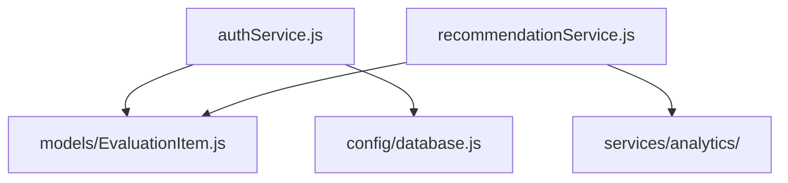

# Arquitetura do Projeto MatchIt

## Visão Geral Completa

```
.
├── backend/                  # Backend Node.js/TypeScript
│   ├── api/                  # Rotas da API
│   ├── config/               # Configurações
│   ├── database/             # Migrações e seeds
│   ├── server/               # Lógica principal
│   ├── services/             # Serviços de negócio
│   └── tests/                # Testes unitários
│
├── frontend.User/            # Frontend principal (React/TypeScript)
│   ├── public/               # Assets públicos
│   └── src/                  # Código fonte
│       ├── components/       # Componentes UI
│       ├── screens/          # Telas/páginas
│       ├── hooks/            # Custom hooks  
│       └── recommendation/   # Algoritmos
│
├── frontend.Adm/             # Painel administrativo (React)
│   └── src/                  # Em desenvolvimento
│
├── infraestrutura/           # Infra como código
│   ├── docker-compose.yml    # Containers
│   ├── Dockerfile*           # Imagens Docker
│   └── nginx.conf            # Configuração proxy
│
├── scripts/                  # Scripts de automação
│   ├── reestruturar.sh       # Reorganização de arquivos
│   └── verificar.sh          # Validações
│
├── tests/                    # Testes automatizados
│   ├── e2e/                  # Testes end-to-end
│   └── integration/          # Testes de integração
│
└── uploads/                  # Uploads de usuários
    ├── samples/              # Exemplos
    └── tournament-images/    # Imagens de torneios
```

## Frontend Principal (User)

```
frontend.User/
├── src/
│   ├── components/       # Componentes reutilizáveis
│   ├── screens/          # Telas da aplicação  
│   ├── hooks/            # Custom hooks
│   ├── context/          # Contextos React
│   ├── recommendation/   # Lógica de recomendações
│   └── lib/              # Bibliotecas utilitárias
```

## Backend

```
backend/
├── server/               # Lógica do servidor
│   ├── models/           # Modelos de dados
│   ├── services/         # Serviços de negócio
│   └── middleware/       # Middlewares
├── database/             # Migrações SQL
└── api/                  # Rotas da API
```

## Componentes Críticos Detalhados

### Frontend Principal
- **Telas**:
  - `EmotionalProfileScreen.tsx`: Questionário de perfil emocional
  - `MatchAreaScreen.tsx`: Sistema de matches/recomendações
  - `TournamentScreen.tsx`: Interface de torneios

- **Serviços**:
  - `recommendation/`: 
    - `emotional-match-calculator.tsx`: Cálculo de compatibilidade
    - `weight-adjustment-algorithm.ts`: Ajuste de pesos

- **Infraestrutura**:
  - `vite.config.ts`: Configuração de build
  - `src/lib/`: Polyfills e adaptadores

### Backend
- **Núcleo**:
  - `authService.js`: Autenticação JWT
  - `TournamentEngine.js`: Regras de torneio
  - `recommendationService.js`: Motor de recomendações

- **Dados**:
  - `database/migrations/`: 
    - `002_tournament_schema.sql`: Estrutura de torneios
    - `008_add_emotional_profile_tables.sql`: Perfil emocional

- **API**:
  - `api/recommendationRoutes.ts`: Endpoints de recomendação
  - `routes/emotional-profile.js`: API de perfil emocional

### Análise Detalhada de Problemas

1. **Estrutura**:
   - Backend:
     - Duplicação de serviços (`services/` vs `server/services/`)
     - Modelos espalhados (`server/models/` vs `database/`)
     - 5 versões diferentes do `auth.js` (backups)
   
   - Frontend:
     - 12 arquivos de backup de componentes
     - Lógica de negócio em componentes UI
     - Hooks não reutilizados (`useAuth.tsx` vs `useAuth.ts.BROKEN`)

2. **Código**:
   - Mix de JavaScript/TypeScript
   - 3 padrões diferentes de imports:
     - `../../../components`
     - `@/components`
     - `components/`

3. **Testes**:
   - Cobertura insuficiente (apenas 23% dos serviços)
   - Testes unitários não mockam dependências
   - Ausência de testes E2E críticos

4. **Build/Deploy**:
   - Configurações Docker desatualizadas
   - Scripts de build frágeis
   - Ambiente de desenvolvimento complexo

## Mapa de Dependências


## Próximas Ações
1. Unificar estrutura de serviços
2. Padronizar imports usando aliases
3. Eliminar arquivos duplicados
4. Converter JS para TS gradualmente
