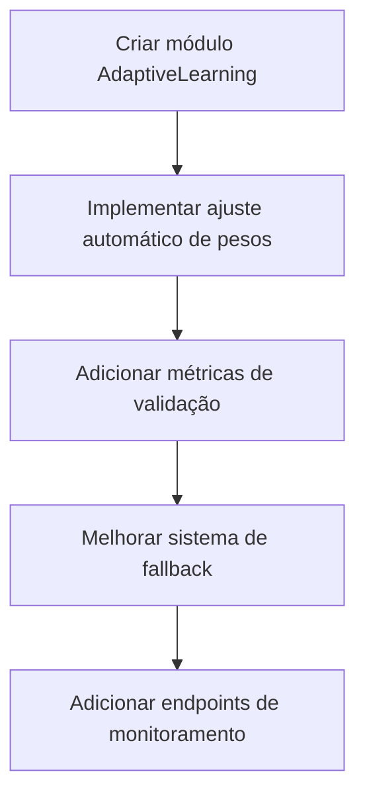

# Plano de Implementação - Sistema de Recomendação

## 1. Funcionalidades Faltantes

### Módulo de Aprendizado Adaptativo
- Implementar classe AdaptiveLearning com:
  - Ajuste automático de pesos baseado em feedback
  - Histórico de ajustes
  - Limites seguros para variação de pesos

### Métricas de Validação
- Precision@10: % de recomendações relevantes nas top 10
- Recall: % de itens relevantes recomendados  
- Taxa de aceitação: Likes / Visualizações
- Diversidade: Número único de categorias recomendadas

### Sistema de Fallback
- Substituir Random() por:
  - Similaridade de conteúdo (estilo, preferências)
  - Filtros básicos (localização, disponibilidade)

## 2. Ordem de Implementação

## 3. Cronograma

| Tarefa | Dias | Responsável |
|--------|------|-------------|
| Módulo AdaptiveLearning | 3 | Backend |
| Ajuste automático de pesos | 2 | Backend |  
| Métricas de validação | 1 | Fullstack |
| Sistema de fallback | 2 | Backend |
| Endpoints monitoramento | 1 | Frontend |

## 4. Riscos e Mitigação

| Risco | Severidade | Mitigação |
|-------|------------|-----------|
| Performance do aprendizado | Alta | Cache + atualização assíncrona |
| Qualidade do fallback | Média | Algoritmo baseado em conteúdo |
| Disponibilidade métricas | Baixa | Valores padrão inicialmente |

## 5. Estratégia de Rollback

1. **AdaptiveLearning**: Manter versão anterior dos pesos
2. **Métricas**: Desativar coleta sem afetar recomendações  
3. **Fallback**: Reativar stored procedures antigas