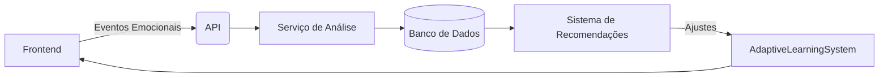
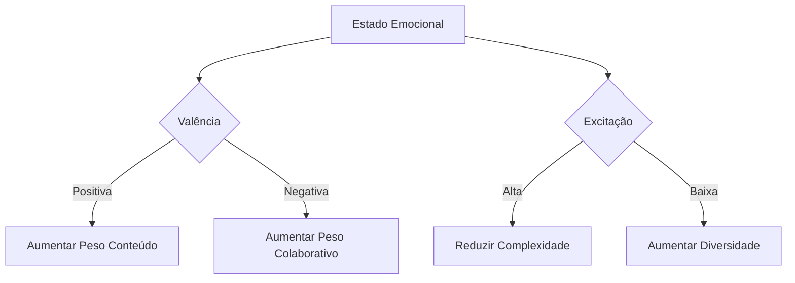
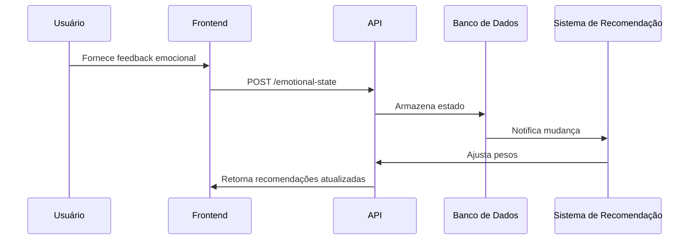

# Plano Detalhado de Implementação do Módulo Emocional (v2.0)

**Status**: Aprovado para implementação
**Última Atualização**: 18/06/2025
**Responsável**: Equipe de Recomendação

## 1. Arquitetura do Módulo Emocional



**Componentes Principais:**
1. `EmotionTracker`: Coleta contínua de sinais emocionais
2. `EmotionAnalysisService`: Processamento e análise
3. `EmotionAwareRecommender`: Adaptação das recomendações

O módulo emocional será uma extensão do sistema atual, adicionando:
- Nova tabela `user_emotional_profile` no banco de dados
- Novos tipos e interfaces no sistema
- Novos endpoints na API
- Adaptação do mecanismo de ajuste de pesos

## 2. Tipos Necessários em recommendation/index.ts

```typescript
// Tipos para perfil emocional
export interface EmotionalState {
  timestamp: Date;
  valence: number; // -1 (negativo) a 1 (positivo)
  arousal: number; // 0 (calmo) a 1 (excitado)
  dominance?: number; // 0 (submisso) a 1 (dominante)
  tags?: string[]; // Tags emocionais (ex: "frustrado", "animado")
}

export interface EmotionalProfile {
  userId: number;
  baseline: EmotionalState;
  current: EmotionalState;
  history: EmotionalState[];
}

export interface EmotionalWeightAdjustment extends WeightAdjustmentParams {
  emotionalContext: EmotionalState;
}
```

## 3. Rotas Adicionais em recommendationRoutes.ts

```typescript
// Nova rota para registro de estado emocional
recommendationRouter.post<{}, {}, {userId: number, state: EmotionalState}>(
  '/emotional-state',
  async (req, res) => {
    // Implementar lógica de registro
  }
);

// Rota para obter perfil emocional
recommendationRouter.get<{userId: number}>(
  '/emotional-profile/:userId',
  async (req, res) => {
    // Implementar lógica de consulta
  }
);
```

## 4. Estratégia de Coleta de Dados Emocionais

**Fontes de dados:**
1. Questionários curtos pós-interação
2. Análise de texto em chats
3. Padrões de interação (velocidade, precisão)
4. Integração com wearables (futuro)

**Frequência:**
- Coleta ativa: 1x/dia (questionário)
- Coleta passiva: contínua (análise de interações)

## 5. Impacto nos Pesos dos Algoritmos



**Modelo de Influência:**
- Valência positiva: +0.1 conteúdo, -0.05 colaborativo
- Valência negativa: +0.1 colaborativo, -0.05 conteúdo
- Alta excitação: limitar complexidade das recomendações
- Baixa excitação: aumentar diversidade

## 6. Métricas de Validação

1. **Engajamento:** Taxa de aceitação de recomendações
2. **Satisfação:** Pesquisas pós-interação
3. **Precisão:** Acurácia emocional das recomendações
4. **Performance:** Tempo de resposta do sistema

## 7. Cronograma (2 semanas)

**Semana 1:**
- Dias 1-2: Modelagem de dados e tipos
- Dias 3-4: Implementação do banco de dados
- Dia 5: API básica

**Semana 2:**
- Dias 6-7: Integração com sistema de pesos
- Dias 8-9: Coleta de dados emocionais
- Dia 10: Testes e ajustes

## 8. Riscos, Métricas e Monitoramento

**Dashboard de Monitoramento:**
- Emoções ativas por usuário
- Taxa de coleta de dados
- Impacto nos algoritmos

**Alertas Automáticos:**
1. Queda na coleta de dados
2. Variações anômalas nos padrões emocionais
3. Degradação de performance

**Riscos Atualizados:**
| Risco | Probabilidade | Impacto | Mitigação |
|-------|--------------|---------|-----------|
| Viés na coleta | Médio | Alto | Diversificação de fontes |
| Latência na análise | Baixo | Médio | Otimização de queries |
| Privacidade de dados | Alto | Crítico | Anonimização agregada |

| Risco | Mitigação |
|-------|-----------|
| Baixa adoção de questionários | Gamificação (pontos por resposta) |
| Dados emocionais imprecisos | Validação cruzada com múltiplas fontes |
| Impacto negativo nos pesos | Limites conservadores iniciais |

## Diagrama de Fluxo de Dados Emocionais



## Plano de Testes A/B

**Grupo A:** Recomendações com influência emocional  
**Grupo B:** Recomendações padrão  

Métricas comparadas após 2 semanas:
- Taxa de retenção
- Satisfação reportada
- Número de interações

## Estratégia de Rollback

1. Desativar rotas emocionais via feature flag
2. Reverter para pesos padrão
3. Manter dados para análise posterior