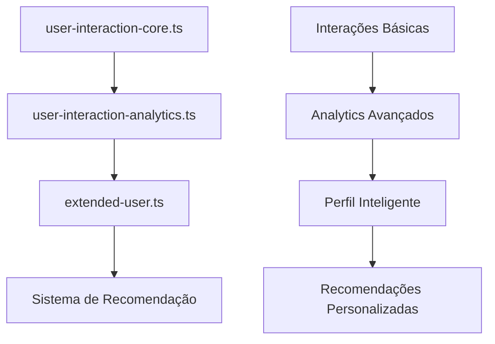

# Arquitetura dos Tipos de Interação - Sistema MatchIt

## 🏗️ Estrutura Modular

### Camada 1: **Core Types** (`user-interaction-core.ts`)
**Responsabilidade**: Tipos fundamentais para interações básicas

```typescript
// Interação básica entre usuários
interface UserInteraction {
  userId: string;
  targetUserId: string;
  action: FeedbackAction;
  context: InteractionContext;
  // ... dados essenciais
}

// Contexto detalhado da interação
interface InteractionContext {
  viewTime: number;
  scrollDepth: number;
  deviceType: DeviceType;
  source: InteractionSource;
  // ... contexto comportamental
}
```

**Funcionalidades**:
- ✅ Definições básicas de interação
- ✅ Contexto de dispositivo e localização
- ✅ Padrões comportamentais simples
- ✅ Feedback sobre recomendações

---

### Camada 2: **Analytics** (`user-interaction-analytics.ts`)
**Responsabilidade**: Análises avançadas e métricas

```typescript
// Métricas avançadas de engajamento
interface EngagementMetrics {
  engagementRate: number;
  retentionRate: number;
  matchRate: number;
  conversationStartRate: number;
  // ... métricas complexas
}

// Análise comportamental profunda
interface UserBehaviorAnalysis {
  primaryBehaviorType: BehaviorPatternType;
  behaviorEvolution: BehaviorEvolution[];
  revealedPreferences: RevealedPreference[];
  behaviorPredictions: BehaviorPrediction[];
  // ... análises preditivas
}
```

**Funcionalidades**:
- 📊 Métricas de engajamento detalhadas
- 🧠 Análise de sentiment e comportamento
- 🔮 Predições comportamentais
- 📈 Analytics de sessão detalhados
- 🎯 Recomendações de otimização

---

### Camada 3: **Extended User** (`extended-user.ts`)
**Responsabilidade**: Perfil completo e contextualizado

```typescript
// Perfil estendido com dados de interação
interface ExtendedUserProfile extends User {
  personalityProfile: PersonalityProfile;
  emotionalProfile: EmotionalProfile;
  lifestyleProfile: LifestyleProfile;
  interactionHistory: InteractionHistorySummary;
  learningProfile: LearningProfile;
  // ... perfil holístico
}

// Resumo inteligente das interações
interface InteractionHistorySummary {
  totalInteractions: number;
  likeRate: number;
  matchRate: number;
  preferredAgeRange: [number, number];
  mostLikedCategories: StyleCategory[];
  // ... insights derivados
}
```

**Funcionalidades**:
- 👤 Perfil psicológico e emocional
- 🎯 Preferências reveladas por comportamento
- 🧠 Sistema de aprendizado adaptativo
- ⏰ Padrões temporais e sazonais
- 🔒 Configurações de privacidade

---

## 🔄 Como os Arquivos se Complementam

### **Fluxo de Dados**:


### **Relação de Dependência**:

1. **Core** fornece tipos básicos
2. **Analytics** usa Core + adiciona métricas avançadas
3. **Extended User** usa ambos + adiciona contexto holístico

### **Especialização por Domínio**:

| Arquivo | Foco Principal | Casos de Uso |
|---------|---------------|--------------|
| **Core** | Interações básicas | Logging, feedback simples |
| **Analytics** | Métricas e insights | Dashboards, ML training |
| **Extended User** | Perfil completo | Personalização, matching |

---

## 🎯 Benefícios da Arquitetura Modular

### ✅ **Separação de Responsabilidades**
- Cada arquivo tem um propósito específico
- Facilita manutenção e evolução
- Permite importação seletiva

### ✅ **Escalabilidade**
- Adicionar novos tipos de analytics
- Expandir perfil do usuário
- Manter compatibilidade

### ✅ **Reusabilidade**
- Core types usados em múltiplos contextos
- Analytics aplicáveis a diferentes features
- Perfil extensível para novas funcionalidades

### ✅ **Testabilidade**
- Cada camada pode ser testada independentemente
- Mocks simplificados
- Validação por camada

---

## 🚀 Próximos Passos

### **Implementação Recomendada**:
1. Implementar **Core Types** primeiro
2. Adicionar **Analytics** gradualmente
3. Evoluir **Extended User** conforme necessidade

### **Integrações**:
- Sistema de Recomendação usa todos os três
- APIs específicas podem usar subconjuntos
- Frontend consome tipos simplificados

### **Monitoramento**:
- Métricas de uso por tipo
- Performance de queries por camada
- Qualidade dos dados em cada nível
