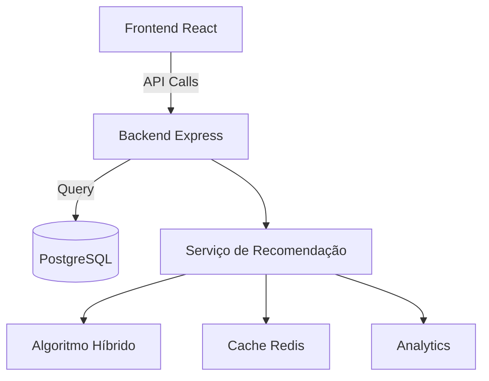

# Guia Técnico - MatchIt

## 📚 Visão Geral
Sistema de recomendação inteligente que conecta pessoas baseado em:
- Compatibilidade de estilo
- Perfil psicológico
- Localização geográfica
- Comportamento e interações

**Tecnologias Principais:**
- Frontend: React + TypeScript + TailwindCSS
- Backend: Node.js + Express
- Banco de Dados: PostgreSQL
- Machine Learning: Algoritmos híbridos

## 🏗️ Arquitetura do Sistema

### Diagrama de Componentes


### Fluxo de Recomendação
1. Usuário acessa `/match-area`
2. Frontend chama `GET /api/recommendations`
3. Backend valida autenticação
4. Serviço de Recomendação calcula matches:
   - Busca candidatos no banco
   - Aplica algoritmo de compatibilidade
   - Filtra por preferências
   - Ordena por score
5. Retorna lista de recomendações

## 🛠️ Configuração do Ambiente

### Pré-requisitos
- Node.js 18+
- PostgreSQL 14+
- Redis (opcional para cache)

### Passo a Passo
```bash
# 1. Clonar repositório
git clone https://github.com/matchit-project/matchit.git

# 2. Instalar dependências
npm install
cd server && npm install

# 3. Configurar banco de dados
psql -U postgres -f scripts/Banco\ de\ dados/init_db.sql

# 4. Configurar variáveis de ambiente
cp .env.example .env
# Editar .env com suas credenciais

# 5. Iniciar servidor
npm run dev
```

## 📝 Padrões de Código

### Frontend (React/TypeScript)
- Seguir guia em [`docs/STYLE_GUIDE.md`](docs/STYLE_GUIDE.md)
- Componentes devem:
  - Ser tipados corretamente
  - Usar constantes de estilo
  - Ser responsivos
  - Seguir convenções de nomeação

Exemplo de componente:
```tsx
interface RecommendationCardProps {
  userId: string;
  matchScore: number;
  onLike: () => void;
}

const RecommendationCard: React.FC<RecommendationCardProps> = ({ 
  userId,
  matchScore,
  onLike
}) => {
  // Implementação
}
```

### Backend (Node.js/Express)
- Rotas devem:
  - Validar entrada
  - Lidar com erros
  - Retornar respostas padronizadas

Exemplo de rota:
```javascript
router.get('/recommendations', async (req, res) => {
  try {
    const recommendations = await recommendationService.getForUser(req.user.id);
    res.json({
      success: true,
      data: recommendations
    });
  } catch (error) {
    errorHandler(error, req, res);
  }
});
```

## 🔍 Estrutura de Diretórios

```
matchit/
├── client/               # Frontend React
│   ├── components/       # Componentes reutilizáveis
│   ├── screens/          # Telas principais
│   └── services/         # Chamadas API
├── server/               # Backend Node.js
│   ├── config/           # Configurações
│   ├── middleware/       # Middlewares
│   ├── routes/           # Rotas API
│   └── services/         # Lógica de negócio
├── recommendation/       # Lógica de recomendação
│   ├── algorithms/       # Implementações
│   └── analytics/       # Análise de dados
└── scripts/             # Scripts utilitários
```

## 🧪 Testes

### Tipos de Testes
1. **Unitários**: Componentes e funções isoladas
2. **Integração**: Fluxos entre serviços
3. **E2E**: Fluxos completos do usuário

### Executando Testes
```bash
# Testes unitários
npm test

# Testes de integração
npm run test:integration

# Testes E2E
npm run test:e2e
```

## 🚀 Deployment

### Opção 1: Docker
```bash
docker-compose up --build
```

### Opção 2: Manual
1. Build do frontend:
```bash
npm run build
```

2. Iniciar servidor:
```bash
NODE_ENV=production node server/app.js
```

## 📊 Monitoramento

Endpoints importantes:
- `GET /health` - Saúde do sistema
- `GET /metrics` - Métricas de performance
- `GET /analytics` - Dados de uso

## 🤝 Contribuição

1. Criar branch a partir de `main`
2. Seguir convenções de código
3. Atualizar documentação
4. Criar PR com descrição clara

## 📌 Próximos Passos

- [ ] Implementar testes E2E
- [ ] Adicionar documentação Swagger
- [ ] Criar dashboard de métricas
- [ ] Otimizar algoritmos

Última atualização: 13 de junho de 2025