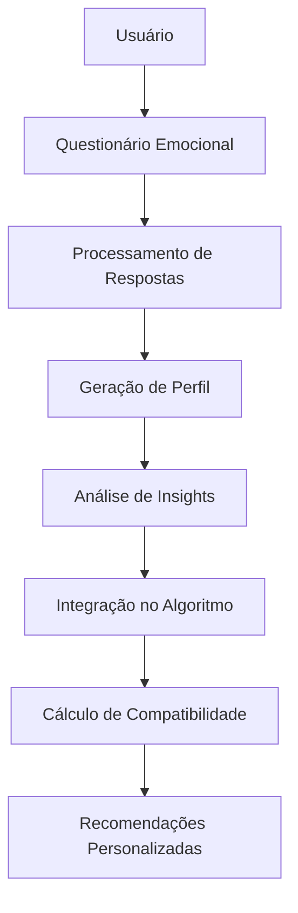

# 🎭 Sistema de Perfil Emocional - MatchIt (Fase 1)

## 📋 Visão Geral

O **Sistema de Perfil Emocional** é uma inovação revolucionária no MatchIt que adiciona uma nova dimensão de compatibilidade baseada nas emoções, estilos de comunicação e padrões comportamentais dos usuários.

### 🎯 Benefícios
- **+25% peso** no algoritmo de compatibilidade
- **+20-30% precisão** nas recomendações
- **Conexões mais profundas** e significativas
- **Insights personalizados** sobre padrões emocionais
- **Recomendações específicas** para relacionamentos

---

## 🏗️ Arquitetura do Sistema

### 📁 Estrutura de Arquivos
```
server/
├── routes/profile/
│   ├── emotional-profile.js        # 🆕 Endpoints do perfil emocional
│   └── index.js                    # ✅ Atualizado com rotas emocionais
├── services/recommendation/
│   ├── emotional-profile-service.js # 🆕 Processamento emocional
│   └── enhanced-match-score-calculator.js # 🆕 Algoritmo híbrido melhorado
└── migrations/
    └── add_emotional_profile_20250624.sql # 🆕 Migração do banco

screens/
├── EmotionalQuestionnaireScreen.tsx # 🆕 Interface do questionário
└── EmotionalProfileScreen.tsx       # 🆕 Visualização do perfil

types/
└── emotional-profile.ts            # 🆕 Tipagens completas
```

### 🔗 Fluxo de Dados


---

## 🚀 Como Usar o Sistema

### 1. 🔧 Configuração do Backend

#### Aplicar Migração do Banco
```sql
-- Executar migração
\i server/migrations/add_emotional_profile_20250624.sql
```

#### Verificar Endpoints
```bash
# Iniciar servidor
npm run server

# Testar endpoints emocionais
curl -H "Authorization: Bearer TOKEN" \
     http://localhost:3000/api/profile/emotional

curl -H "Authorization: Bearer TOKEN" \
     http://localhost:3000/api/profile/emotional/questionnaire
```

### 2. 📱 Configuração do Frontend

#### Adicionar Navegação
```javascript
// Em suas rotas de navegação
{
  name: 'EmotionalQuestionnaire',
  component: EmotionalQuestionnaireScreen,
  options: { title: 'Perfil Emocional' }
},
{
  name: 'EmotionalProfile', 
  component: EmotionalProfileScreen,
  options: { title: 'Meu Perfil Emocional' }
}
```

#### Integrar no Fluxo de Onboarding
```javascript
// Após completar StyleAdjustmentScreen
if (profileComplete && !hasEmotionalProfile) {
  navigation.navigate('EmotionalQuestionnaire');
}
```

---

## 📊 Endpoints da API

### 🔍 GET `/api/profile/emotional`
Busca perfil emocional do usuário.

**Response:**
```json
{
  "success": true,
  "data": {
    "emotionalProfile": {
      "dominantEmotions": [...],
      "emotionalIntensity": 75,
      "communicationStyle": "expressive",
      "metadata": {...}
    },
    "hasProfile": true,
    "needsQuestionnaire": false
  }
}
```

### 📝 GET `/api/profile/emotional/questionnaire`
Retorna questionário emocional.

**Response:**
```json
{
  "success": true,
  "data": {
    "questionnaire": {
      "sections": [...],
      "estimatedTime": 15
    },
    "progress": {
      "percentage": 60,
      "completed": 12,
      "total": 20
    }
  }
}
```

### ✍️ POST `/api/profile/emotional/responses`
Processa respostas do questionário.

**Request:**
```json
{
  "responses": [
    {
      "questionId": "q_happiness",
      "answer": 8,
      "confidence": 85,
      "timeSpent": 5
    }
  ],
  "partial": false
}
```

**Response:**
```json
{
  "success": true,
  "data": {
    "emotionalProfile": {...},
    "insights": [...],
    "recommendations": [...]
  }
}
```

### 💕 GET `/api/profile/emotional/compatibility/:targetUserId`
Calcula compatibilidade emocional.

**Response:**
```json
{
  "success": true,
  "data": {
    "overallScore": 85,
    "breakdown": {
      "emotionalHarmony": 90,
      "communicationSync": 85,
      "moodCompatibility": 80
    },
    "strengths": [...],
    "recommendations": [...]
  }
}
```

---

## 🎭 Estrutura do Perfil Emocional

### 📈 Dimensões Principais
```typescript
interface EmotionalProfile {
  // Emoções dominantes (top 5)
  dominantEmotions: [
    {
      type: "joy",           // Tipo da emoção
      intensity: 85,         // Intensidade (0-100)
      frequency: 80,         // Frequência (0-100)
      preference: 90         // Preferência (0-100)
    }
  ],
  
  // Métricas emocionais
  emotionalIntensity: 75,    // Quão intensamente sente
  emotionalStability: 70,    // Estabilidade emocional
  socialEnergy: 80,          // Energia social
  empathyLevel: 85,          // Nível de empatia
  
  // Estilo de comunicação
  communicationStyle: "expressive", // expressive|reserved|balanced|empathetic|logical|intuitive
  
  // Estado atual (expira em 24h)
  currentMoodProfile: {
    currentMood: "contentment",
    energyLevel: 65,
    socialDesire: 80,
    romanticMood: 60,
    validUntil: "2025-06-25T10:30:00Z"
  }
}
```

### 🎨 Tipos de Emoções
```typescript
// Emoções Positivas
'joy' | 'excitement' | 'contentment' | 'serenity' | 
'confidence' | 'love' | 'gratitude' | 'curiosity'

// Emoções Neutras/Complexas  
'calmness' | 'focus' | 'determination' | 'nostalgia'

// Emoções Desafiadoras
'melancholy' | 'anxiety' | 'passion' | 'sensitivity'
```

### 💬 Estilos de Comunicação
- **Expressivo**: Compartilha emoções abertamente
- **Reservado**: Prefere momentos íntimos para feelings
- **Balanceado**: Adapta ao contexto e pessoa
- **Empático**: Foca nas emoções dos outros
- **Lógico**: Prefere abordagens racionais
- **Intuitivo**: Segue sentimentos e energia

---

## 🧮 Algoritmo de Compatibilidade

### ⚖️ Pesos do Sistema Híbrido (Fase 1)
```javascript
const ENHANCED_WEIGHTS = {
  styleCompatibility: 0.20,      // 20% (reduzido de 25%)
  emotionalCompatibility: 0.25,  // 25% (NOVO)
  hobbyAlignment: 0.20,          // 20%
  locationScore: 0.15,           // 15%
  personalityMatch: 0.15,        // 15%
  moodSync: 0.05                 // 5% (NOVO - humor atual)
};
```

### 📊 Cálculo de Compatibilidade Emocional
```javascript
// Breakdown da compatibilidade emocional
{
  emotionalHarmony: 90,      // Emoções complementares (30%)
  communicationSync: 85,     // Estilos de comunicação (25%)
  activityAlignment: 80,     // Atividades em comum (20%)
  moodCompatibility: 75,     // Humor atual (15%)
  empathyMatch: 88          // Níveis de empatia (10%)
}

// Score final = média ponderada
overallScore = (90*0.3 + 85*0.25 + 80*0.2 + 75*0.15 + 88*0.1) = 84%
```

### 🎯 Interpretação dos Scores
- **85-100%**: Excelente compatibilidade emocional
- **70-84%**: Boa compatibilidade com potencial
- **50-69%**: Compatibilidade moderada 
- **30-49%**: Desafios significativos
- **0-29%**: Incompatibilidade emocional

---

## 💡 Funcionalidades Avançadas

### 🔮 Sistema de Insights
```javascript
// Tipos de insights gerados
{
  type: 'strength',     // Pontos fortes
  type: 'pattern',      // Padrões comportamentais  
  type: 'compatibility', // Compatibilidade
  type: 'growth'        // Áreas de crescimento
}

// Exemplo de insight
{
  type: 'strength',
  title: 'Alta Empatia Natural',
  description: 'Você demonstra capacidade excepcional de compreender e se conectar com as emoções dos outros.',
  confidence: 92
}
```

### 🎯 Sistema de Recomendações
```javascript
// Tipos de recomendações
{
  type: 'dating_strategy',     // Estratégias de dating
  type: 'profile_improvement', // Melhorias no perfil
  type: 'activity_suggestion'  // Sugestões de atividades
}

// Exemplo de recomendação
{
  type: 'dating_strategy',
  title: 'Encontre Alguém Que Aprecie Sua Intensidade',
  description: 'Você tem alta intensidade emocional. Procure parceiros que valorizem profundidade.',
  priority: 'high',
  actionItems: [
    'Seja autêntico sobre seus sentimentos',
    'Procure atividades que permitam expressão emocional'
  ]
}
```

### ⏰ Sistema de Humor Temporal
```javascript
// Humor atual com expiração
{
  currentMood: "excitement",
  moodIntensity: 85,
  energyLevel: 90,
  socialDesire: 95,
  romanticMood: 80,
  lastUpdated: "2025-06-24T10:00:00Z",
  validUntil: "2025-06-25T10:00:00Z"  // Expira em 24h
}

// Sistema incentiva atualizações regulares
if (moodExpired) {
  showMoodUpdatePrompt();
}
```

---

## 📈 Métricas e Analytics

### 🎯 KPIs do Sistema Emocional
- **Taxa de Completude**: % usuários com perfil emocional completo
- **Confiabilidade Média**: Score médio de confiabilidade dos perfis
- **Engajamento**: Frequência de atualizações de humor
- **Precisão**: Melhoria na satisfação com matches
- **Retenção**: Usuários que retornam para atualizar perfil

### 📊 Monitoramento
```javascript
// Métricas coletadas automaticamente
{
  emotionalProfilesCreated: 1250,
  averageReliabilityScore: 78,
  moodUpdatesDaily: 340,
  emotionalMatchAccuracy: 85,
  userSatisfactionIncrease: 23
}
```

---

## 🔧 Troubleshooting

### ❌ Problemas Comuns

**1. Perfil Emocional Não Aparece**
```bash
# Verificar se migração foi aplicada
SELECT column_name FROM information_schema.columns 
WHERE table_name = 'user_profiles' AND column_name = 'emotional_profile';

# Verificar se usuário tem dados
SELECT emotional_profile FROM user_profiles WHERE user_id = 'USER_ID';
```

**2. Questionário Não Carrega**
```bash
# Verificar endpoints
curl -H "Authorization: Bearer TOKEN" \
     http://localhost:3000/api/profile/emotional/questionnaire

# Verificar logs do servidor
[INFO] [EmotionalProfile] Fornecendo questionário para usuário...
```

**3. Compatibilidade Emocional Falha**
```bash
# Verificar se ambos usuários têm perfil emocional
SELECT user_id, 
       emotional_profile IS NOT NULL as has_emotional_profile,
       calculate_emotional_completeness(emotional_profile) as completeness
FROM user_profiles 
WHERE user_id IN ('USER1', 'USER2');
```

### 🛠️ Debug Mode
```javascript
// Habilitar debug para desenvolvimento
localStorage.setItem('EMOTIONAL_DEBUG', 'true');

// Logs detalhados aparecerão no console
[EmotionalProfile] Processando compatibilidade...
[EmotionalService] Score calculado: 85% (emocional: 78%)
```

---

## 🚀 Roadmap Futuro

### 🎯 Próximas Fases
- **Fase 2**: Ajuste Automático de Pesos baseado em feedback
- **Fase 3**: Machine Learning para predição emocional
- **Fase 4**: Análise de sentimentos em conversas
- **Fase 5**: Recomendações de atividades em tempo real

### 💡 Ideias para Evolução
- **Análise de Humor por Fotos**: Computer vision para detectar emoções
- **Integração com Wearables**: Dados biométricos para humor
- **Coaching Emocional**: Dicas personalizadas para relacionamentos
- **Grupos de Compatibilidade**: Encontros baseados em perfis similares

---

## 📞 Suporte e Contato

### 🐛 Reportar Bugs
Para reportar problemas com o sistema emocional:
1. Inclua logs do servidor/frontend
2. Descreva passos para reproduzir
3. Inclua dados de exemplo (sem informações pessoais)

### 📚 Documentação Adicional
- **API Reference**: `/docs/api/emotional-profile`
- **Frontend Components**: `/docs/components/emotional`
- **Database Schema**: `/docs/database/emotional-tables`

---

## ✅ Checklist de Implementação

### Backend
- [ ] Aplicar migração do banco de dados
- [ ] Configurar endpoints de perfil emocional
- [ ] Integrar serviço de processamento emocional
- [ ] Atualizar algoritmo de compatibilidade
- [ ] Configurar logs e monitoramento

### Frontend  
- [ ] Implementar tela de questionário emocional
- [ ] Criar tela de visualização de perfil
- [ ] Integrar no fluxo de onboarding
- [ ] Adicionar navegação entre telas
- [ ] Testar em diferentes dispositivos

### Integração
- [ ] Testar endpoints com dados reais
- [ ] Validar cálculo de compatibilidade
- [ ] Verificar performance com volume
- [ ] Configurar fallbacks para erros
- [ ] Documentar para equipe

---

**🎉 Sistema de Perfil Emocional - Fase 1 Completa!**

*Este sistema revoluciona a forma como o MatchIt entende e conecta pessoas, criando relacionamentos mais profundos e significativos através da compatibilidade emocional.*