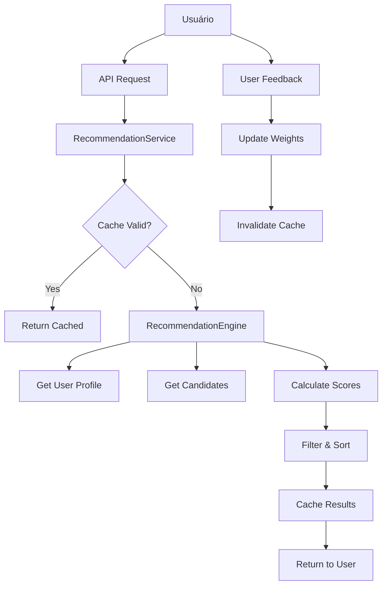

# Sistema de Recomendações MatchIt - Estratégia e Arquitetura

## 🎯 Visão Geral

O sistema de recomendações do MatchIt utiliza uma abordagem **híbrida e adaptatativa** que combina múltiplas técnicas de machine learning e análise de dados para criar conexões mais significativas entre usuários.

## 🧠 Algoritmos Implementados

### 1. **Algoritmo Híbrido (Recomendado)**
Combina múltiplas dimensões de compatibilidade:

- **Compatibilidade de Estilo (25%)**: Analisa escolhas em tênis, roupas e cores
- **Compatibilidade Emocional (20%)**: Baseada no perfil emocional derivado dos sentimentos
- **Compatibilidade de Hobbies (20%)**: Interesses comuns e nível de atividade
- **Score de Localização (15%)**: Proximidade geográfica com decaimento exponencial
- **Match de Personalidade (20%)**: Similaridade dos vetores de personalidade

### 2. **Filtragem Colaborativa**
Baseada no comportamento de usuários similares:
- Identifica usuários com padrões de curtidas similares
- Recomenda perfis que usuários semelhantes gostaram
- Melhora com o tempo conforme mais dados são coletados

### 3. **Filtragem Baseada em Conteúdo**
Foca nas preferências declaradas do usuário:
- Analisa apenas as características do perfil
- Ideal para novos usuários (cold start)
- Menos dependente de dados históricos

## 📊 Estrutura de Dados

### UserProfile
```typescript
interface UserProfile {
  // Dados básicos
  id: string;
  age: number;
  gender: string;
  location: { lat: number; lng: number; city: string };
  
  // Preferências de estilo (Style Adjustment)
  stylePreferences: {
    tenis: number[];      // IDs das escolhas
    roupas: number[];     
    cores: number[];      
    hobbies: number[];    
    sentimentos: number[];
  };
  
  // Vetores calculados
  personalityVector: number[];  // Big Five traits
  emotionalProfile: number[];   // Dimensões emocionais
  activityLevel: number;        // 0-10 baseado em hobbies
  
  // Configurações
  preferences: {
    ageRange: [number, number];
    maxDistance: number;
    genderPreference: string[];
  };
}
```

### Sistema de Scoring
```typescript
interface MatchScore {
  userId: string;
  totalScore: number;           // 0-1 (combinação ponderada)
  breakdown: {
    styleCompatibility: number;   // Similaridade Jaccard
    emotionalCompatibility: number; // Similaridade Cosseno
    hobbyCompatibility: number;   // Hobbies + atividade
    locationScore: number;        // Decaimento exponencial
    personalityMatch: number;     // Similaridade Cosseno
  };
  explanation: string[];          // Motivos do match
}
```

## 🔬 Cálculos Matemáticos

### Similaridade de Estilo (Jaccard)
Para cada categoria (tênis, roupas, cores):
```
J(A,B) = |A ∩ B| / |A ∪ B|
Score_final = média(J_tenis, J_roupas, J_cores)
```

### Compatibilidade Emocional (Cosseno)
```
cos(θ) = (A · B) / (||A|| × ||B||)
onde A e B são vetores emocionais
```

### Score de Localização
```
score = e^(-distância / (max_distância × 0.5))
```

### Compatibilidade de Hobbies
```
score = 0.7 × (hobbies_comuns / max_hobbies) + 
        0.3 × (1 - |atividade_user - atividade_target| / 10)
```

## 🚀 Arquitetura do Sistema

### Componentes Principais

1. **RecommendationEngine**: Core do algoritmo
2. **RecommendationService**: Orquestração e cache
3. **Database Layer**: PostgreSQL com otimizações
4. **API Layer**: RESTful endpoints
5. **Frontend Hooks**: React hooks para consumo

### Fluxo de Dados



## 💾 Otimizações de Performance

### 1. **Cache Inteligente**
- TTL de 30 minutos
- Invalidação baseada em feedback
- Cache por algoritmo e parâmetros

### 2. **Filtros de Database**
- Filtros geoespaciais otimizados
- Índices compostos estratégicos
- Limitação de candidatos (200 max)

### 3. **Lazy Loading**
- Paginação de resultados
- Carregamento sob demanda
- Prefetch inteligente

### 4. **Queries Otimizadas**
```sql
-- Exemplo de query otimizada
SELECT u.*, 
       (6371 * acos(cos(radians($lat)) * cos(radians(latitude)) * 
        cos(radians(longitude) - radians($lng)) + 
        sin(radians($lat)) * sin(radians(latitude)))) as distance
FROM users u
WHERE u.age BETWEEN $age_min AND $age_max
  AND u.gender = ANY($gender_prefs)
  AND ST_DWithin(ST_Point(longitude, latitude), ST_Point($lng, $lat), $max_distance)
ORDER BY distance
LIMIT 200;
```

## 🔄 Sistema de Aprendizado Adaptativo

### Feedback Loop
1. **Coleta de Feedback**: like/dislike/super_like
2. **Análise de Padrões**: Características dos profiles curtidos
3. **Ajuste de Pesos**: Personalização por usuário
4. **Melhoria Contínua**: Algoritmo evolui com uso

### Personalização de Pesos
```typescript
// Exemplo de ajuste automático
if (user_liked_target) {
  if (style_similarity > 0.7) {
    user.weights.style += 0.05; // Aumenta peso do estilo
  }
  if (hobby_similarity > 0.6) {
    user.weights.hobby += 0.03; // Aumenta peso dos hobbies
  }
}
```

## 📈 Métricas e Analytics

### KPIs Principais
- **Taxa de Match**: Matches / Curtidas
- **Taxa de Conversa**: Conversas / Matches  
- **Score Médio**: Qualidade das recomendações
- **Tempo de Engagement**: Tempo gasto visualizando perfis
- **Precisão do Algoritmo**: Feedback positivo / Total

### Eventos Trackados
```typescript
interface AnalyticsEvent {
  user_id: string;
  event_type: 'recommendation_shown' | 'like_given' | 'match_created';
  data: {
    algorithm_used: string;
    match_score: number;
    user_characteristics: object;
  };
  timestamp: Date;
}
```

## 🛡️ Estratégias Anti-Spam e Qualidade

### Filtros de Qualidade
- **Rate Limiting**: Max 100 curtidas/dia
- **Detecção de Bots**: Padrões suspeitos de uso
- **Validação de Perfil**: Fotos verificadas, perfil completo
- **Feedback Negativo**: Penalização por reports

### Cold Start Problem
- **Onboarding Inteligente**: Style Adjustment detalhado
- **Perfil Inferido**: Baseado em escolhas iniciais
- **Boost Inicial**: Maior visibilidade para novos usuários
- **Fallback Algorithm**: Content-based para usuários novos

## 🔮 Futuras Melhorias

### Machine Learning Avançado
- **Deep Learning**: Redes neurais para padrões complexos
- **Computer Vision**: Análise de fotos para compatibilidade
- **NLP**: Análise de bio e conversas
- **Reinforcement Learning**: Otimização automática de pesos

### Funcionalidades Avançadas
- **Temporal Matching**: Horários preferenciais
- **Social Graph**: Amigos em comum
- **Interest Graph**: Interesses implícitos
- **Behavioral Signals**: Tempo de visualização, scroll patterns

### Escalabilidade
- **Microserviços**: Separar componentes
- **Redis Cluster**: Cache distribuído  
- **GraphQL**: API mais eficiente
- **CDN**: Distribuição global

## 🔧 Configuração e Deploy

### Variáveis de Ambiente
```bash
# Algoritmo
RECOMMENDATION_ALGORITHM=hybrid
RECOMMENDATION_CACHE_TTL=1800
MAX_CANDIDATES=200

# Pesos padrão
DEFAULT_STYLE_WEIGHT=0.25
DEFAULT_EMOTIONAL_WEIGHT=0.20
DEFAULT_HOBBY_WEIGHT=0.20
DEFAULT_LOCATION_WEIGHT=0.15
DEFAULT_PERSONALITY_WEIGHT=0.20

# Performance
ENABLE_CACHE=true
ENABLE_ANALYTICS=true
MAX_RECOMMENDATIONS_PER_REQUEST=50
```

### Monitoramento
```typescript
// Exemplo de métricas Prometheus
const recommendationLatency = new Histogram({
  name: 'recommendation_generation_duration_seconds',
  help: 'Time to generate recommendations',
  buckets: [0.1, 0.5, 1, 2, 5]
});

const matchRate = new Gauge({
  name: 'current_match_rate',
  help: 'Current match rate percentage'
});
```

## 📝 Considerações de Implementação

### Prioridades de Desenvolvimento
1. **MVP**: Algoritmo híbrido básico ✅
2. **Fase 1**: Feedback loop e aprendizado
3. **Fase 2**: ML avançado e personalização
4. **Fase 3**: Features sociais e temporais

### Testes e Validação
- **A/B Testing**: Comparar algoritmos
- **Metrics Dashboard**: Monitoramento em tempo real
- **User Surveys**: Feedback qualitativo
- **Performance Testing**: Load testing com dados reais

Este sistema oferece uma base sólida e escalável para o MatchIt, priorizando qualidade das conexões sobre quantidade de matches.