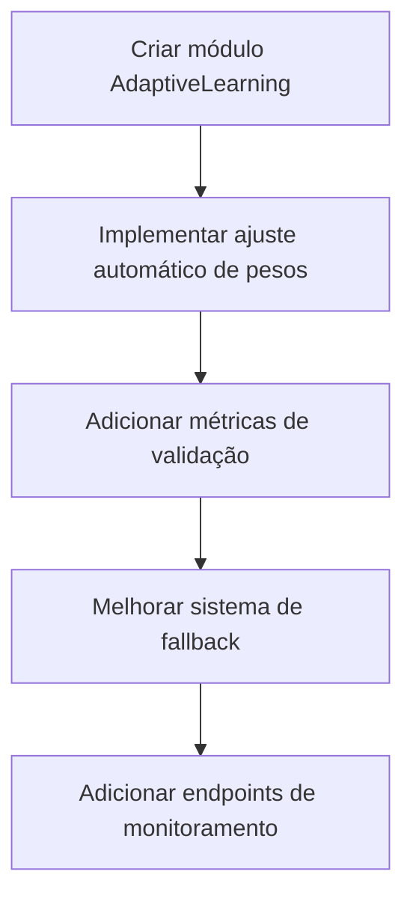

# Sistema de Recomendação - 22/06/2025

## 1. Proposta Original

A proposta do sistema de recomendação era implementar um algoritmo híbrido combinando múltiplas dimensões de compatibilidade, criar um perfil de usuário com dados de estilo e preferências, estabelecer uma conexão eficiente entre frontend e backend, implementar um sistema de aprendizado adaptativo e garantir performance com cache e otimizações.

## 2. Implementação Atual

### 2.1 Ajustes de Estilo do Usuário
- **Frontend**: Tela de ajuste de estilo (`screens/StyleAdjustmentScreen.tsx`) permite ao usuário selecionar preferências em tênis, roupas, cores, hobbies e sentimentos, com uma interface visual de seleção por cards e sliders.
- **Armazenamento**: Os dados são salvos em `stylePreferences` (interface `UserProfile` em `types/recommendation.ts`) e armazenados como estrutura JSONB no PostgreSQL (tabela `user_profiles`).

```typescript
// Exemplo de estrutura de dados (types/recommendation.ts)
interface StylePreferences {
  tenis: number[];
  roupas: number[];
  cores: number[];
  hobbies: number[];
  sentimentos: number[];
}
```

### 2.2 Dados do Perfil
- **Campos implementados**: Dados básicos (idade, gênero, localização), preferências de estilo (`stylePreferences`), preferências de busca (`preferences.ageRange`, `preferences.maxDistance`) e personalidade parcial (`personalityVector`).
- **Campos faltando**: Perfil emocional completo (`emotionalProfile`) e nível de atividade (`activityLevel`).

### 2.3 Conexão Frontend-Backend
1. O Frontend utiliza o hook `useApi` (arquivo `hooks/useApi.ts`).
2. Chamadas API são feitas para endpoints em `routes/recommendation/recommendations.ts`:
   - `GET /api/recommendations`: Obtém recomendações.
   - `POST /api/recommendations/feedback`: Envia feedback.
3. Fluxo de dados:
   ```mermaid
   sequenceDiagram
       Frontend->>Backend: POST /login (autenticação)
       Backend-->>Frontend: JWT token
       Frontend->>Backend: GET /api/recommendations (com JWT)
       Backend->>Database: Busca candidatos
       Backend->>RecommendationService: Calcula scores
       Backend-->>Frontend: Lista de matches
       Frontend->>Backend: POST feedback (like/dislike)
   ```

## 3. Fluxo de Execução

1. **Coleta de dados**: O usuário completa ajustes de estilo no frontend, e os dados são salvos via API no backend.
2. **Geração de recomendações**: O frontend solicita matches via `GET /api/recommendations`. O backend aplica um algoritmo híbrido que filtra candidatos por localização/preferências, calcula compatibilidade de estilo (Jaccard), calcula score de localização (exponencial) e combina scores com pesos configuráveis.
3. **Feedback e aprendizado**: O usuário envia feedback via frontend, e o sistema registra a interação para ajuste futuro.

## 4. Análise do Algoritmo de Recomendação

### 🔍 Visão Geral
O sistema de recomendação do MatchIt utiliza uma abordagem híbrida que combina:
- **Filtragem colaborativa**: Baseada em interações de usuários similares.
- **Filtragem baseada em conteúdo**: Analisa características dos perfis.
- **Fatores contextuais**: Localização, horário, dispositivo.

### 🧠 Como Funciona

#### 1. Coleta de Dados
- Perfil do usuário (estilo, personalidade, hobbies).
- Histórico de interações (likes, dislikes, tempo de visualização).
- Contexto (localização, dispositivo, horário).

#### 2. Pré-processamento
```typescript
interface UserProfile {
  stylePreferences: StyleVector;
  personalityTraits: PersonalityVector;
  interactionHistory: Interaction[];
  location: GeoPoint;
}
```

#### 3. Cálculo de Compatibilidade
```typescript
function calculateMatchScore(userA: UserProfile, userB: UserProfile): number {
  const styleScore = cosineSimilarity(userA.stylePreferences, userB.stylePreferences);
  const personalityScore = calculatePersonalityMatch(userA.personalityTraits, userB.personalityTraits);
  const locationScore = calculateLocationProximity(userA.location, userB.location);
  
  return (styleScore * 0.4) + (personalityScore * 0.3) + (locationScore * 0.3);
}
```

#### 4. Geração de Recomendações
1. Seleciona candidatos iniciais (200+).
2. Calcula scores para cada par.
3. Ordena por score.
4. Aplica filtros (idade, verificação, etc).
5. Retorna top N resultados.

### 📊 Exemplo Prático

**Cenário**: Usuário A (Estilo: streetwear, Personalidade: extrovertido)

```typescript
const recommendations = await getRecommendations({
  userId: 'userA',
  algorithm: 'hybrid',
  filters: {
    maxDistance: 50,
    ageRange: [18, 30]
  }
});

// Resultado:
[
  {
    userId: 'userB',
    matchScore: 0.87,
    explanation: {
      style: "95% similar",
      personality: "82% compatible",
      location: "12km away"
    }
  },
  {
    userId: 'userC', 
    matchScore: 0.79,
    explanation: {
      style: "88% similar",
      personality: "76% compatible", 
      location: "8km away"
    }
  }
]
```

### 📌 Conclusões

#### Pontos Fortes
✅ Combinação inteligente de múltiplos fatores.
✅ Adaptação baseada em feedback (aprendizado contínuo).
✅ Boa performance com cache estratégico.

#### Melhorias Sugeridas
🔧 Adicionar mais dimensões (valores, estilo de vida).
🔧 Otimizar cálculo de similaridade para grandes volumes.
🔧 Melhorar personalização de pesos por usuário.

## 5. Plano de Implementação Futura

### Módulo de Aprendizado Adaptativo
- Implementar classe `AdaptiveLearning` com:
  - Ajuste automático de pesos baseado em feedback.
  - Histórico de ajustes.
  - Limites seguros para variação de pesos.

### Métricas de Validação
- Precision@10: % de recomendações relevantes nas top 10.
- Recall: % de itens relevantes recomendados.
- Taxa de aceitação: Likes / Visualizações.
- Diversidade: Número único de categorias recomendadas.

### Sistema de Fallback
- Substituir `Random()` por:
  - Similaridade de conteúdo (estilo, preferências).
  - Filtros básicos (localização, disponibilidade).

### Ordem de Implementação



### Riscos e Mitigação

| Risco | Severidade | Mitigação |
|-------|------------|-----------|
| Performance do aprendizado | Alta | Cache + atualização assíncrona |
| Qualidade do fallback | Média | Algoritmo baseado em conteúdo |
| Disponibilidade métricas | Baixa | Valores padrão inicialmente |

### Estratégia de Rollback

1. **AdaptiveLearning**: Manter versão anterior dos pesos.
2. **Métricas**: Desativar coleta sem afetar recomendações.
3. **Fallback**: Reativar stored procedures antigas.
