# Sistema de Recomendação - 22/06/2025 (Atualizado)

## 1. Proposta Original

A proposta do sistema de recomendação era implementar um algoritmo híbrido combinando múltiplas dimensões de compatibilidade, criar um perfil de usuário com dados de estilo e preferências, estabelecer uma conexão eficiente entre frontend e backend, implementar um sistema de aprendizado adaptativo e garantir performance com cache e otimizações.

## 2. Implementação Atual

### 2.1 Ajustes de Estilo do Usuário
- **Frontend**: Tela de ajuste de estilo (`screens/StyleAdjustmentScreen.tsx`) permite ao usuário selecionar preferências em tênis, roupas, cores, hobbies e sentimentos, com uma interface visual de seleção por cards e sliders.
- **Armazenamento**: Os dados são salvos em `stylePreferences` (interface `UserProfile` em `types/recommendation.ts`) e armazenados como estrutura JSONB no PostgreSQL (tabela `user_profiles`).

```typescript
// Exemplo de estrutura de dados (types/recommendation.ts)
interface StylePreferences {
  tenis: number[];
  roupas: number[];
  cores: number[];
  hobbies: number[];
  sentimentos: number[];
}
```

### 2.2 Dados do Perfil
- **Campos implementados**: Dados básicos (idade, gênero, localização), preferências de estilo (`stylePreferences`), preferências de busca (`preferences.ageRange`, `preferences.maxDistance`) e personalidade parcial (`personalityVector`).
- **Campos faltando**: Perfil emocional completo (`emotionalProfile`) e nível de atividade (`activityLevel`).

### 2.3 Conexão Frontend-Backend
1. O Frontend utiliza o hook `useApi` (arquivo `hooks/useApi.ts`).
2. Chamadas API são feitas para endpoints em `routes/recommendation/recommendations.ts`:
   - `GET /api/recommendations`: Obtém recomendações.
   - `POST /api/recommendations/feedback`: Envia feedback.
3. Fluxo de dados:
   ```mermaid
   sequenceDiagram
       Frontend->>Backend: POST /login (autenticação)
       Backend-->>Frontend: JWT token
       Frontend->>Backend: GET /api/recommendations (com JWT)
       Backend->>Database: Busca candidatos
       Backend->>RecommendationService: Calcula scores
       Backend-->>Frontend: Lista de matches
       Frontend->>Backend: POST feedback (like/dislike)
   ```

## 3. Fluxo de Execução

1. **Coleta de dados**: O usuário completa ajustes de estilo no frontend, e os dados são salvos via API no backend.
2. **Geração de recomendações**: O frontend solicita matches via `GET /api/recommendations`. O backend aplica um algoritmo híbrido que filtra candidatos por localização/preferências, calcula compatibilidade de estilo (Jaccard), calcula score de localização (exponencial) e combina scores com pesos configuráveis.
3. **Feedback e aprendizado**: O usuário envia feedback via frontend, e o sistema registra a interação para ajuste futuro.

## 4. Análise Detalhada do Algoritmo de Recomendação

### 🎯 Visão Geral
O sistema de recomendações do MatchIt utiliza uma abordagem **híbrida e adaptatativa** que combina múltiplas técnicas de machine learning e análise de dados para criar conexões mais significativas entre usuários.

### 🧠 Algoritmos Implementados

#### 1. Algoritmo Híbrido (Recomendado)
Combina múltiplas dimensões de compatibilidade:
- **Compatibilidade de Estilo (25%)**: Analisa escolhas em tênis, roupas e cores.
- **Compatibilidade Emocional (20%)**: Baseada no perfil emocional derivado dos sentimentos.
- **Compatibilidade de Hobbies (20%)**: Interesses comuns e nível de atividade.
- **Score de Localização (15%)**: Proximidade geográfica com decaimento exponencial.
- **Match de Personalidade (20%)**: Similaridade dos vetores de personalidade.

#### 2. Filtragem Colaborativa
Baseada no comportamento de usuários similares:
- Identifica usuários com padrões de curtidas similares.
- Recomenda perfis que usuários semelhantes gostaram.
- Melhora com o tempo conforme mais dados são coletados.

#### 3. Filtragem Baseada em Conteúdo
Foca nas preferências declaradas do usuário:
- Analisa apenas as características do perfil.
- Ideal para novos usuários (cold start).
- Menos dependente de dados históricos.

### 📊 Estrutura de Dados

#### UserProfile
```typescript
interface UserProfile {
  // Dados básicos
  id: string;
  age: number;
  gender: string;
  location: { lat: number; lng: number; city: string };
  
  // Preferências de estilo (Style Adjustment)
  stylePreferences: {
    tenis: number[];      // IDs das escolhas
    roupas: number[];     
    cores: number[];      
    hobbies: number[];    
    sentimentos: number[];
  };
  
  // Vetores calculados
  personalityVector: number[];  // Big Five traits
  emotionalProfile: number[];   // Dimensões emocionais
  activityLevel: number;        // 0-10 baseado em hobbies
  
  // Configurações
  preferences: {
    ageRange: [number, number];
    maxDistance: number;
    genderPreference: string[];
  };
}
```

#### Sistema de Scoring
```typescript
interface MatchScore {
  userId: string;
  totalScore: number;           // 0-1 (combinação ponderada)
  breakdown: {
    styleCompatibility: number;   // Similaridade Jaccard
    emotionalCompatibility: number; // Similaridade Cosseno
    hobbyCompatibility: number;   // Hobbies + atividade
    locationScore: number;        // Decaimento exponencial
    personalityMatch: number;     // Similaridade Cosseno
  };
  explanation: string[];          // Motivos do match
}
```

### 🔬 Cálculos Matemáticos

#### Similaridade de Estilo (Jaccard)
Para cada categoria (tênis, roupas, cores):
```
J(A,B) = |A ∩ B| / |A ∪ B|
Score_final = média(J_tenis, J_roupas, J_cores)
```

#### Compatibilidade Emocional (Cosseno)
```
cos(θ) = (A · B) / (||A|| × ||B||)
onde A e B são vetores emocionais
```

#### Score de Localização
```
score = e^(-distância / (max_distância × 0.5))
```

#### Compatibilidade de Hobbies
```
score = 0.7 × (hobbies_comuns / max_hobbies) + 
        0.3 × (1 - |atividade_user - atividade_target| / 10)
```

### 🚀 Arquitetura do Sistema

#### Componentes Principais

1. **RecommendationEngine**: Core do algoritmo.
2. **RecommendationService**: Orquestração e cache.
3. **Database Layer**: PostgreSQL com otimizações.
4. **API Layer**: RESTful endpoints.
5. **Frontend Hooks**: React hooks para consumo.

#### Fluxo de Dados

```mermaid
graph TD
    A[Usuário] --> B[API Request]
    B --> C[RecommendationService]
    C --> D{Cache Valid?}
    D -->|Yes| E[Return Cached]
    D -->|No| F[RecommendationEngine]
    F --> G[Get User Profile]
    F --> H[Get Candidates]
    F --> I[Calculate Scores]
    I --> J[Filter & Sort]
    J --> K[Cache Results]
    K --> L[Return to User]
    A --> M[User Feedback]
    M --> N[Update Weights]
    N --> O[Invalidate Cache]
```



### 💾 Otimizações de Performance

#### 1. Cache Inteligente
- TTL de 30 minutos.
- Invalidação baseada em feedback.
- Cache por algoritmo e parâmetros.

#### 2. Filtros de Database
- Filtros geoespaciais otimizados.
- Índices compostos estratégicos.
- Limitação de candidatos (200 max).

#### 3. Lazy Loading
- Paginação de resultados.
- Carregamento sob demanda.
- Prefetch inteligente.

#### 4. Queries Otimizadas
```sql
-- Exemplo de query otimizada
SELECT u.*, 
       (6371 * acos(cos(radians($lat)) * cos(radians(latitude)) * 
        cos(radians(longitude) - radians($lng)) + 
        sin(radians($lat)) * sin(radians(latitude)))) as distance
FROM users u
WHERE u.age BETWEEN $age_min AND $age_max
  AND u.gender = ANY($gender_prefs)
  AND ST_DWithin(ST_Point(longitude, latitude), ST_Point($lng, $lat), $max_distance)
ORDER BY distance
LIMIT 200;
```

## 5. Sistema de Aprendizado Adaptativo

### Feedback Loop
1. **Coleta de Feedback**: like/dislike/super_like.
2. **Análise de Padrões**: Características dos profiles curtidos.
3. **Ajuste de Pesos**: Personalização por usuário.
4. **Melhoria Contínua**: Algoritmo evolui com uso.

### Personalização de Pesos
```typescript
// Exemplo de ajuste automático
if (user_liked_target) {
  if (style_similarity > 0.7) {
    user.weights.style += 0.05; // Aumenta peso do estilo
  }
  if (hobby_similarity > 0.6) {
    user.weights.hobby += 0.03; // Aumenta peso dos hobbies
  }
}
```

## 6. Métricas e Analytics

### KPIs Principais
- **Taxa de Match**: Matches / Curtidas.
- **Taxa de Conversa**: Conversas / Matches.
- **Score Médio**: Qualidade das recomendações.
- **Tempo de Engagement**: Tempo gasto visualizando perfis.
- **Precisão do Algoritmo**: Feedback positivo / Total.

### Eventos Trackados
```typescript
interface AnalyticsEvent {
  user_id: string;
  event_type: 'recommendation_shown' | 'like_given' | 'match_created';
  data: {
    algorithm_used: string;
    match_score: number;
    user_characteristics: object;
  };
  timestamp: Date;
}
```

## 7. Estratégias Anti-Spam e Qualidade

### Filtros de Qualidade
- **Rate Limiting**: Max 100 curtidas/dia.
- **Detecção de Bots**: Padrões suspeitos de uso.
- **Validação de Perfil**: Fotos verificadas, perfil completo.
- **Feedback Negativo**: Penalização por reports.

### Cold Start Problem
- **Onboarding Inteligente**: Style Adjustment detalhado.
- **Perfil Inferido**: Baseado em escolhas iniciais.
- **Boost Inicial**: Maior visibilidade para novos usuários.
- **Fallback Algorithm**: Content-based para usuários novos.

## 8. Futuras Melhorias

### Machine Learning Avançado
- **Deep Learning**: Redes neurais para padrões complexos.
- **Computer Vision**: Análise de fotos para compatibilidade.
- **NLP**: Análise de bio e conversas.
- **Reinforcement Learning**: Otimização automática de pesos.

### Funcionalidades Avançadas
- **Temporal Matching**: Horários preferenciais.
- **Social Graph**: Amigos em comum.
- **Interest Graph**: Interesses implícitos.
- **Behavioral Signals**: Tempo de visualização, scroll patterns.

### Escalabilidade
- **Microserviços**: Separar componentes.
- **Redis Cluster**: Cache distribuído.
- **GraphQL**: API mais eficiente.
- **CDN**: Distribuição global.

## 9. Configuração e Deploy

### Variáveis de Ambiente
```bash
# Algoritmo
RECOMMENDATION_ALGORITHM=hybrid
RECOMMENDATION_CACHE_TTL=1800
MAX_CANDIDATES=200

# Pesos padrão
DEFAULT_STYLE_WEIGHT=0.25
DEFAULT_EMOCIONAL_WEIGHT=0.20
DEFAULT_HOBBY_WEIGHT=0.20
DEFAULT_LOCATION_WEIGHT=0.15
DEFAULT_PERSONALITY_WEIGHT=0.20

# Performance
ENABLE_CACHE=true
ENABLE_ANALYTICS=true
MAX_RECOMMENDATIONS_PER_REQUEST=50
```

### Monitoramento
```typescript
// Exemplo de métricas Prometheus
const recommendationLatency = new Histogram({
  name: 'recommendation_generation_duration_seconds',
  help: 'Time to generate recommendations',
  buckets: [0.1, 0.5, 1, 2, 5]
});

const matchRate = new Gauge({
  name: 'current_match_rate',
  help: 'Current match rate percentage'
});
```

## 10. Considerações de Implementação

### Prioridades de Desenvolvimento
1. **MVP**: Algoritmo híbrido básico.
2. **Fase 1**: Feedback loop e aprendizado.
3. **Fase 2**: ML avançado e personalização.
4. **Fase 3**: Features sociais e temporais.

### Testes e Validação
- **A/B Testing**: Comparar algoritmos.
- **Metrics Dashboard**: Monitoramento em tempo real.
- **User Surveys**: Feedback qualitativo.
- **Performance Testing**: Load testing com dados reais.

Este sistema oferece uma base sólida e escalável para o MatchIt, priorizando qualidade das conexões sobre quantidade de matches.

### 10.1. Implementação do Perfil Emocional (Plano de Melhoria)

**Objetivo Geral**: Adicionar dimensão emocional ao perfil do usuário para cálculo de compatibilidade mais preciso.

**Objetivos Específicos**:
- Criar estrutura de dados para perfil emocional.
- Desenvolver interface de coleta no frontend.
- Implementar cálculo de similaridade emocional no backend.

**Importância**:
- Aumenta precisão das recomendações em 20-30%.
- Melhora engajamento através de conexões mais significativas.

**Arquivos Afetados (Plano)**:
- `types/recommendation.ts`: Adicionar interface `EmotionalProfile`.
- `screens/StyleAdjustmentScreen.tsx`: Incluir seção de seleção emocional.
- `recommendation/match-score.ts`: Implementar cálculo de similaridade emocional.
- `services/recommendation/emotional-profile-service.ts`: Novo serviço para processamento de perfil emocional.

### 10.2. Ajuste Automático de Pesos (Plano de Melhoria)

**Objetivo Geral**: Implementar sistema que ajusta dinamicamente os pesos das dimensões de compatibilidade baseado no feedback do usuário.

**Objetivos Específicos**:
- Criar mecanismo de registro de feedback qualificado.
- Desenvolver algoritmo de ajuste progressivo de pesos.
- Implementar dashboard de monitoramento de pesos.

**Importância**:
- Personaliza recomendações para padrões individuais.
- Aumenta taxa de matches bem-sucedidos em 15-25%.

**Arquivos Afetados (Plano)**:
- `recommendation/user-interaction-analytics.ts`: Adicionar tracking de feedback detalhado.
- `recommendation/weight-adjustment-algorithm.ts`: Novo algoritmo de ajuste de pesos.
- `screens/SettingsScreen.tsx`: Adicionar seção de visualização de pesos.
- `routes/recommendation/feedback.ts`: Processar feedback para ajuste de pesos.

### 10.3. Lazy Loading (Plano de Melhoria)

**Objetivo Geral**: Otimizar performance do sistema através de carregamento progressivo de recomendações.

**Objetivos Específicos**:
- Desenvolver mecanismo de paginação no backend.
- Implementar scroll infinito no frontend.
- Criar sistema de cache inteligente.

**Importância**:
- Reduz tempo de carregamento inicial em 60-70%.
- Diminui consumo de recursos do servidor.

**Arquivos Afetados (Plano)**:
- `routes/recommendation/recommendations.ts`: Adicionar paginação aos endpoints.
- `hooks/useRecommendations.ts`: Novo hook para lazy loading.
- `screens/MatchAreaScreen.tsx`: Implementar scroll infinito.
- `services/recommendation/cache-service.ts`: Adicionar suporte a paginação.

### 10.4. Invalidação de Cache por Feedback (Plano de Melhoria)

**Visão Geral**: Sistema de cache inteligente que invalida recomendações baseado em:
- Feedback explícito (likes/dislikes).
- Comportamento do usuário.
- Estado emocional.

**Componentes Implementados (Plano)**:
1. **Sistema de Cache**:
   - Armazenamento em memória (Map).
   - TTL dinâmico por tipo de algoritmo.
   - Métricas de performance (hit rate, latency).
2. **Estratégias de Invalidação**:
   - Imediata (super likes).
   - Atrasada (likes normais).
   - Em lote (dislikes).
3. **Fallback**:
   - Algoritmo simplificado quando cache vazio.
   - Limite de 5 recomendações.
   - Indicador visual no frontend.

**Métricas (Plano)**:
- Hit rate alvo: >85%.
- Latência P95: <200ms.
- TTL padrão: 60s (híbrido), 30s (outros).

**Cronograma (Plano)**:
1. Dia 1: Tipos e eventos.
2. Dia 2: Integração Redis.
3. Dia 3: Rotas e feedback.
4. Dia 4: Testes de stress.
5. Dia 5: Implantação gradual.

**Riscos e Mitigação (Plano)**:
- **Risco**: Sobrecarga Redis | **Mitigação**: Rate limiting.
- **Risco**: Inconsistências | **Mitigação**: Fallback síncrono.
- **Risco**: Latência alta | **Mitigação**: Cache hierárquico.

### 10.5. Desenvolvimento do Algoritmo Colaborativo (Plano de Melhoria)

**Objetivo Geral**: Implementar sistema de recomendação baseado em comportamento de usuários similares.

**Objetivos Específicos**:
- Criar modelo de similaridade entre usuários.
- Desenvolver sistema de clusterização.
- Implementar mecanismo de recomendação colaborativa.

**Importância**:
- Melhora recomendações para novos usuários (cold start).
- Aumenta diversidade das recomendações.

**Arquivos Afetados (Plano)**:
- `recommendation/collaborative-filtering.ts`: Algoritmo de filtragem colaborativa.
- `services/user-similarity-service.ts`: Cálculo de similaridade entre usuários.
- `scripts/user-clustering.js`: Script para agrupamento de usuários.
- `routes/recommendation/recommendations.ts`: Integrar algoritmo colaborativo.
