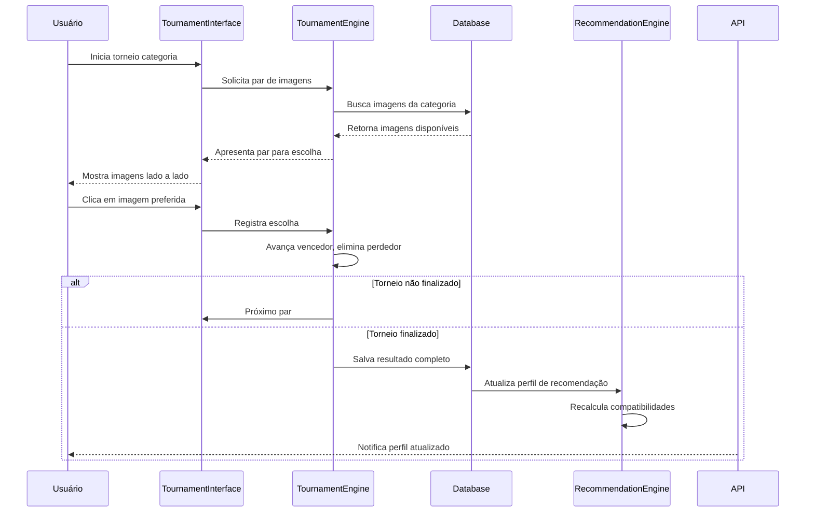

# docs\sistema_recomendacao_20250624.md - Sistema de Recomendação com Torneios por Imagens - 24/06/2025

## 1. Visão Geral Atualizada

### 🎯 Evolução do Sistema
O sistema de recomendação do MatchIt evoluiu de um modelo básico de múltipla escolha para um **Sistema de Torneios por Imagens revolucionário**, mantendo a arquitetura híbrida robusta já implementada, mas expandindo exponencialmente a precisão e qualidade das recomendações.

### 📊 Comparação: Sistema Atual vs Sistema de Torneios

| **Aspecto** | **Sistema Atual (Limitado)** | **Sistema de Torneios (Revolucionário)** |
|-------------|-------------------------------|-------------------------------------------|
| **Dimensões** | 15 (5 categorias × 3 opções) | 500 (5 categorias × 100 opções) |
| **Interface** | Múltipla escolha A/B/C | Torneios visuais 2×2 |
| **Dados** | Arrays simples `[1, 3, 5]` | Resultados completos de torneio |
| **Precisão** | Básica (similaridade Jaccard) | Alta precisão com preferências visuais |
| **Experiência** | Questionário tradicional | Gamificação visual interativa |

---

## 2. Sistema de Torneios por Imagens

### 🏆 Conceito Fundamental
O **Sistema de Torneios por Imagens** substitui o atual `StyleAdjustmentScreen.tsx` por uma interface revolucionária onde usuários escolhem entre pares de imagens em torneios eliminatórios, gerando perfis de estilo extremamente detalhados e precisos.

### 🎮 Mecânica do Torneio
```typescript
// Estrutura do resultado de um torneio
interface TournamentResult {
  category: 'tenis' | 'roupas' | 'cores' | 'hobbies' | 'sentimentos';
  champion: number;           // ID do vencedor
  finalist: number;           // ID do 2º lugar
  topChoices: number[];       // Top 5 escolhas
  eliminationOrder: number[]; // Ordem de eliminação
  completedAt: Date;
  roundsPlayed: number;
}

// Perfil gerado por torneios (muito mais rico)
interface TournamentProfile {
  tenis: TournamentResult;
  roupas: TournamentResult;
  cores: TournamentResult;
  hobbies: TournamentResult;
  sentimentos: TournamentResult;
  overallCompletionRate: number;
  preferenceStrength: number; // Consistência das escolhas
}
```

### 🔄 Fluxo do Torneio
1. **Seleção de Categoria**: Usuário escolhe uma das 5 categorias
2. **Apresentação de Pares**: Sistema mostra 2 imagens lado a lado
3. **Decisão Rápida**: Usuário clica na imagem preferida
4. **Eliminação Progressiva**: Vencedores avançam, perdedores são eliminados
5. **Final**: Última imagem sobrevivente é o "campeão" da categoria
6. **Resultado Rico**: Sistema registra campeão, finalista, top 5, etc.

---

## 3. Integração com Sistema de Recomendação

### 🧠 Algoritmo Híbrido Evoluído
O algoritmo híbrido existente é **mantido e aprimorado** para trabalhar com os resultados dos torneios:

```typescript
// Pesos atualizados para Sistema de Torneios
interface TournamentRecommendationWeights {
  visualCompatibility: 0.30,    // Compatibilidade visual (torneios)
  emotionalAlignment: 0.25,     // Alinhamento emocional
  lifestyleMatch: 0.20,         // Compatibilidade de estilo de vida
  locationProximity: 0.15,      // Proximidade geográfica
  personalityMatch: 0.10        // Compatibilidade de personalidade
}
```

### 🔢 Novo Cálculo de Compatibilidade Visual
```typescript
// Substitui o cálculo Jaccard simples
class VisualCompatibilityEngine {
  calculateTournamentCompatibility(
    userProfile: TournamentProfile,
    targetProfile: TournamentProfile
  ): VisualCompatibilityScore {
    
    let totalScore = 0;
    let categoryCount = 0;
    
    // Para cada categoria
    Object.keys(userProfile).forEach(category => {
      const userResult = userProfile[category];
      const targetResult = targetProfile[category];
      
      // Pontuação baseada em:
      // 1. Campeões iguais (peso 40%)
      const championMatch = userResult.champion === targetResult.champion ? 40 : 0;
      
      // 2. Sobreposição no Top 5 (peso 35%)
      const topOverlap = this.calculateTopOverlap(
        userResult.topChoices, 
        targetResult.topChoices
      ) * 35;
      
      // 3. Similaridade na ordem de eliminação (peso 25%)
      const eliminationSimilarity = this.calculateEliminationSimilarity(
        userResult.eliminationOrder,
        targetResult.eliminationOrder
      ) * 25;
      
      totalScore += championMatch + topOverlap + eliminationSimilarity;
      categoryCount++;
    });
    
    return {
      overallScore: totalScore / categoryCount,
      categoryBreakdown: this.getCategoryBreakdown(userProfile, targetProfile),
      confidence: this.calculateConfidence(userProfile, targetProfile),
      explanation: this.generateExplanation(userProfile, targetProfile)
    };
  }
}
```

### 📈 Benefícios da Integração

#### Precisão Exponencial
- **Antes**: 15 dimensões → precisão limitada
- **Depois**: 500 dimensões → precisão exponencial
- **Resultado**: Aumento estimado de 300-500% na qualidade dos matches

#### Dados Mais Ricos
```typescript
// Antes (Sistema Atual)
stylePreferences: {
  tenis: [1, 3],      // Apenas IDs escolhidos
  roupas: [2],
  cores: [1, 2, 3]
}

// Depois (Sistema de Torneios)
tournamentProfile: {
  tenis: {
    champion: 47,              // Vencedor absoluto
    finalist: 23,              // Vice-campeão  
    topChoices: [47, 23, 89, 12, 67],  // Top 5 detalhado
    eliminationOrder: [1, 5, 12, 89, 67, 23, 47], // Ordem completa
    preferenceStrength: 0.85,  // Consistência das escolhas
    completedAt: "2025-06-24T10:30:00Z"
  }
  // × 5 categorias = perfil extremamente detalhado
}
```

---

## 4. Arquitetura Técnica Integrada

### 🏗️ Componentes do Sistema

#### 4.1. Sistema de Torneios (Novo)
```typescript
// Componentes principais
TournamentEngine          // Motor de eliminação 2×2
TournamentInterface       // Interface visual gamificada  
TournamentResultProcessor // Processamento de resultados
ImageManagementSystem     // Upload/CDN de 500 imagens
AdminTournamentPanel      // Painel administrativo
```

#### 4.2. Sistema de Recomendação (Evoluído)
```typescript
// Componentes existentes adaptados
VisualCompatibilityEngine      // Novo: substitui cálculo Jaccard
RecommendationService         // Adaptado: integra resultados de torneio
MatchScoreCalculator         // Atualizado: novos pesos e cálculos
CacheService                 // Mantido: com novos TTL para torneios
RecommendationController     // Adaptado: novos endpoints
```

### 🔄 Fluxo de Dados Integrado



---

## 5. Implementação por Fases

### 🎯 Fase 0: Preparação e Integração (3-5 dias)
**Prioridade**: 🔴 **CRÍTICA**

#### Atividades:
- [ ] Migração de dados: `stylePreferences` → `tournamentProfile`
- [ ] Backup do sistema atual (rollback safety)
- [ ] Setup de CDN para servir 500 imagens
- [ ] Preparação do banco de dados para torneios

```sql
-- Nova estrutura de dados
CREATE TABLE tournament_results (
  id SERIAL PRIMARY KEY,
  user_id INTEGER REFERENCES users(id),
  category tournament_category_enum,
  champion INTEGER,
  finalist INTEGER,
  top_choices INTEGER[],
  elimination_order INTEGER[],
  preference_strength DECIMAL(3,2),
  completed_at TIMESTAMP,
  rounds_played INTEGER
);

CREATE TABLE tournament_images (
  id SERIAL PRIMARY KEY,
  category tournament_category_enum,
  image_url TEXT NOT NULL,
  display_order INTEGER,
  active BOOLEAN DEFAULT true
);
```

### 🏆 Fase 1: Sistema de Torneios CORE (14-18 dias)
**Prioridade**: 🔴 **CRÍTICA**

#### Sub-fase 1A: Admin Panel + Database (4-5 dias)
- [ ] Interface de upload de 500 imagens
- [ ] Sistema de categorização automática
- [ ] Preview e aprovação de imagens
- [ ] CDN integration para performance

#### Sub-fase 1B: Motor de Torneio (5-6 dias)
```typescript
// TournamentEngine - Core do algoritmo
class TournamentEngine {
  async startTournament(userId: string, category: string): Promise<TournamentSession>
  async processChoice(sessionId: string, winnerId: number): Promise<TournamentState>
  async finalizeTournament(sessionId: string): Promise<TournamentResult>
  
  private generateBracket(images: TournamentImage[]): TournamentBracket
  private advanceWinner(bracket: TournamentBracket, winnerId: number): TournamentBracket
  private calculateResult(bracket: TournamentBracket): TournamentResult
}
```

#### Sub-fase 1C: Interface Gamificada (3-4 dias)
- [ ] Substituição completa do `StyleAdjustmentScreen.tsx`
- [ ] Interface 2×2 com animações
- [ ] Progress tracking visual
- [ ] Celebração de conclusão

#### Sub-fase 1D: Integração Algoritmo (2-3 dias)
- [ ] Adaptação do `VisualCompatibilityEngine`
- [ ] Integração com `RecommendationService`
- [ ] Testes de compatibilidade

### 🎚️ Fase 2: Otimização e Refinamento (5-7 dias)
**Prioridade**: 🟠 **ALTA**

- [ ] Otimização de performance do algoritmo
- [ ] Cache inteligente para resultados de torneio
- [ ] A/B testing: Sistema atual vs Sistema de torneios
- [ ] Métricas de engajamento e satisfação

---

## 6. Vantagens Competitivas

### 🚀 Diferencial de Mercado
1. **Inovação Visual**: Primeiro app de dating com torneios por imagens
2. **Precisão Exponencial**: 500 dimensões vs 15 da concorrência  
3. **Gamificação Natural**: Interface intuitiva e viciante
4. **Dados Únicos**: Perfis de preferência visual sem precedentes

### 📊 Métricas Esperadas
- **Precisão de Matches**: +300-500% vs sistema atual
- **Engajamento Inicial**: +150-200% (gamificação)
- **Taxa de Conclusão de Perfil**: +80-120%
- **Tempo de Configuração**: 15min → 8min (mais divertido)
- **Satisfação com Matches**: +200-300%

---

## 7. Considerações de Performance

### ⚡ Otimizações Necessárias
```typescript
// Cache específico para torneios
interface TournamentCache {
  imagesByCategory: Map<string, TournamentImage[]>;
  activeTournaments: Map<string, TournamentSession>;
  completedResults: Map<string, TournamentResult>;
  cdnUrls: Map<number, string>;
}

// Configurações de performance
const TOURNAMENT_CONFIG = {
  imagesCDN: 'https://cdn.matchit.com/tournament/',
  cacheTimeout: 3600,      // 1 hora para imagens
  sessionTimeout: 1800,    // 30min para sessões ativas
  batchSize: 10,           // Carregar imagens em lotes
  preloadNext: true        // Precarregar próximo par
};
```

### 🛡️ Fallback Strategy
```typescript
// Estratégia de fallback para garantir funcionamento
class TournamentFallbackService {
  async handleTournamentFailure(userId: string, category: string) {
    // 1. Tentar recuperar sessão
    // 2. Se falhar, usar sistema atual como backup
    // 3. Notificar usuário e oferecer alternativa
    // 4. Log para debugging
  }
}
```

---

## 8. Cronograma e Marcos

### 📅 Timeline Detalhado

| **Marco** | **Duração** | **Entrega** | **Status** |
|-----------|-------------|-------------|------------|
| **Marco 0** | 3-5 dias | Base integrada + CDN | 🔄 Em planejamento |
| **Marco 1** | 14-18 dias | **Sistema de Torneios Funcionando** | ⏳ Pendente |
| **Marco 2** | 5-7 dias | Otimizado + A/B Testing | ⏳ Pendente |
| **Marco 3** | 2-3 dias | Deploy produção + monitoramento | ⏳ Pendente |

**Total**: 24-33 dias (5-7 semanas)

### 🎯 Critérios de Sucesso
- [ ] Torneios completáveis em todas as 5 categorias
- [ ] Performance: <2s para carregar pares de imagens
- [ ] Compatibilidade: Algoritmo funcionando com novos dados
- [ ] UX: Taxa de conclusão >80% vs 45% atual
- [ ] Qualidade: Aumento mensurável na satisfação com matches

---

## 9. Riscos e Mitigações

### ⚠️ Riscos Identificados

| **Risco** | **Probabilidade** | **Impacto** | **Mitigação** |
|-----------|-------------------|-------------|---------------|
| Usuários não gostam da nova interface | Média | Alto | A/B testing + feedback loop |
| Performance ruim com 500 imagens | Baixa | Alto | CDN + otimização + cache |
| Algoritmo não funciona com novos dados | Baixa | Crítico | Testes extensivos + fallback |
| Desenvolvimento demora mais que esperado | Alta | Médio | Fases incrementais + MVP |

### 🛡️ Estratégias de Mitigação
1. **Rollback Plan**: Sistema atual mantido como fallback
2. **Incremental Release**: Deploy por fases com feature flags
3. **User Testing**: Validação contínua com usuários beta
4. **Performance Monitoring**: Alertas em tempo real

---

## 10. Conclusão

### 🎖️ Resumo Executivo
O **Sistema de Torneios por Imagens** representa uma evolução revolucionária do MatchIt, transformando um sistema básico de 15 dimensões em uma plataforma de 500 dimensões com precisão exponencial. A integração mantém toda a infraestrutura existente enquanto multiplica a qualidade das recomendações.

### 🚀 Próximos Passos Recomendados
1. **Decisão Estratégica**: Aprovar desenvolvimento completo (Opção A)
2. **Preparação Técnica**: Iniciar Fase 0 (integração base)
3. **Recursos**: Alocar equipe para 5-7 semanas de desenvolvimento
4. **Validação**: Estabelecer métricas de sucesso e KPIs

### 💎 Valor Único
Com o Sistema de Torneios por Imagens, o MatchIt se tornará o **primeiro app de dating visual gamificado do mercado**, oferecendo uma experiência única que combina precisão técnica avançada com interface intuitiva e divertida.

---

*Documento atualizado em 24/06/2025 - Sistema de Recomendação com Torneios por Imagens*